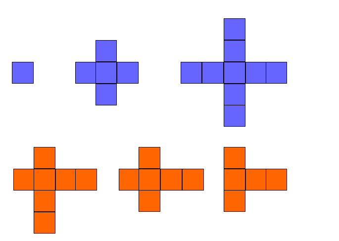
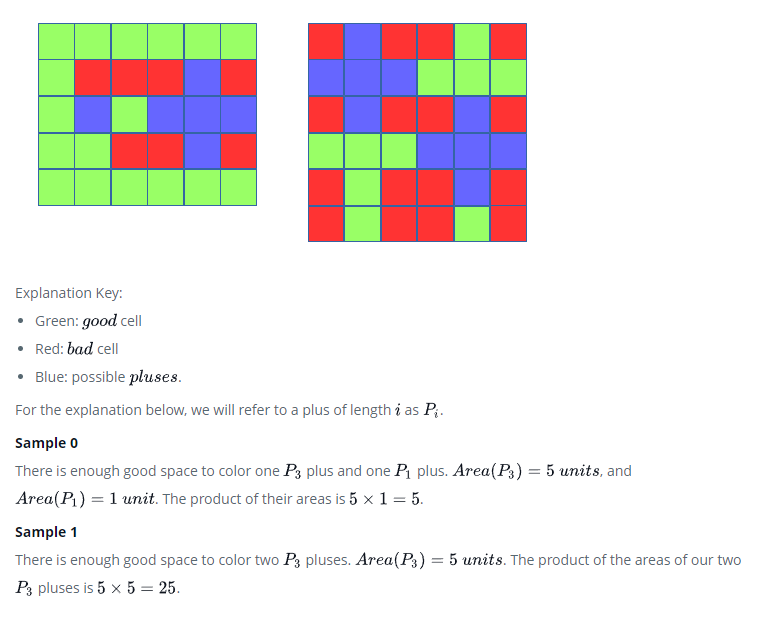

# Emmas-Supercomputer

Ema built a quantum computer! Help her test its capabilities by solving the problem below.

Given a grid of size **nxn**, each cell in the grid is either **good** or **bad**.

A valid plus is defined here as the crossing of two segments (horizontal and vertical) of equal lengths. These lengths must be odd, and the middle cell of its horizontal segment must cross the middle cell of its vertical segment.

In the diagram below, the blue pluses are valid and the orange ones are not valid.



Find the two largest valid pluses that can be drawn on **good** cells in the grid, and return an integer denoting the maximum product of their areas. In the above diagrams, our largest pluses have areas of **5** and **9**. The product of their areas is **5 x 9 = 45**.

**Note**: The two pluses cannot overlap, and the product of their areas should be maximal.

## Function Description

Complete the twoPluses function in the editor below. It should return an integer that represents the area of the two largest pluses.

twoPluses has the following parameter(s):

* grid: an array of strings where each string represents a row and each character of the string represents a column of that row

## Output Format

Find **2** pluses that can be drawn on **good** cells of the grid, and return an integer denoting the maximum product of their areas.

## Sample input 0

```
GGGGGG
GBBBGB
GGGGGG
GGBBGB
GGGGGG
```

## Sample Output 0

```
5
```

## Sample Input 1

```
BGBBGB
GGGGGG
BGBBGB
GGGGGG
BGBBGB
BGBBGB
```

## Sample Output 1

```
25
```

## Explanation

Here are two possible solutions for Sample 0 (left) and Sample 1 (right):



```
    /*
     * Complete the 'twoPluses' function below.
     *
     * The function is expected to return an INTEGER.
     * The function accepts STRING_ARRAY grid as parameter.
     */

    public static int twoPluses(List<string> grid)
    {

    }
```